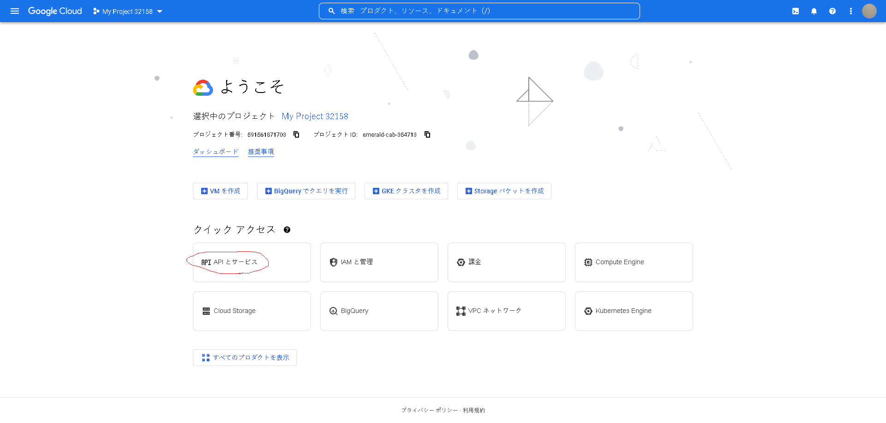
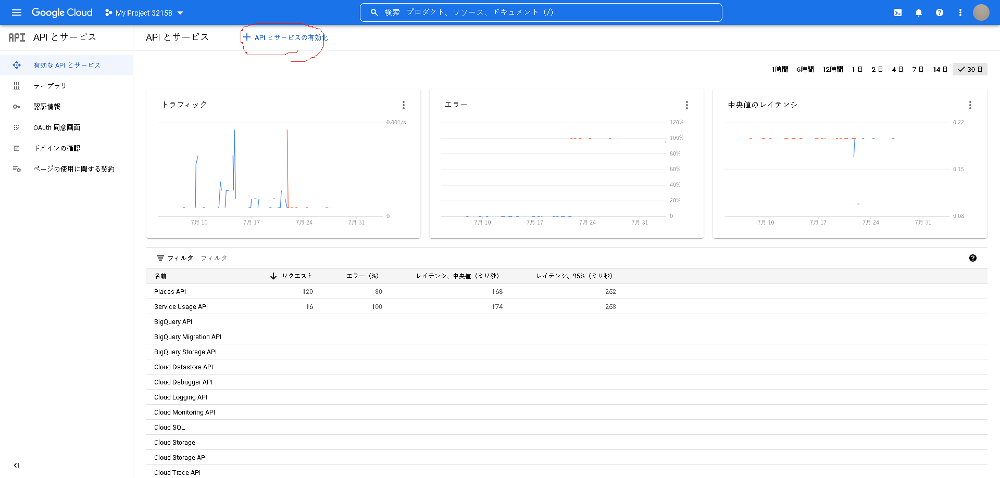
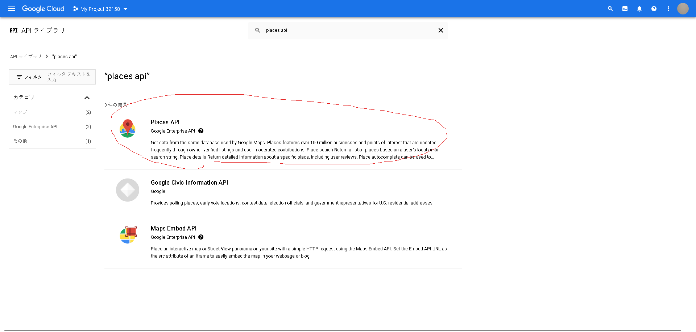
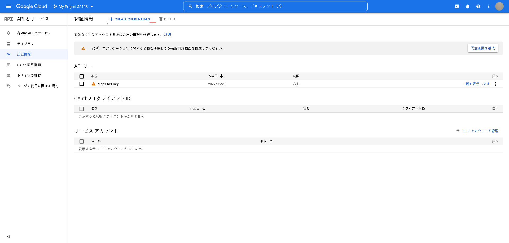

# ANful のカフェブログのデモ

[https://cafe-cms-demo.vercel.app](https://cafe-cms-demo.vercel.app)

# What

Next.js と microCMS を使ったカフェブログ

- 予約機能
- google の口コミ表示

### Feature

#### ライブラリ

- React

#### フレームワーク

- Next.js
- LIFF(LINE Front-end Framework)

#### state 管理

- Redux-toolkit

#### ブログ管理

- microCMS

#### スタイル・UI

- tailwindCSS
- Ant Design

#### ホスティング

- Vercel

### backend

- AWS lambda
- AWS SAM
- AWS DynamoDB
- AWS API Gateway
- AWS CloudFormation

# How

```
git clone https://github.com/edegp/cafe-cms-demo.git
```

```
yarn install # ライブラリのインストール
// or
npm install
```

```
 npm run dev # ローカルで立ち上げ
 // or
 npm run test:https # liff mockを使わない場合
```

[http://localhost:3000](http://localhost:3000)にアクセス

ここまででも、予約機能以外は使えます！

# Frontend

## microCMS

- [アカウント登録](https://microcms.io/docs/manual/signup)

- [ログイン](https://microcms.io/docs/manual/signin)

- [サービスの作成](https://microcms.io/docs/manual/create-service)

api サービスの作成時にエンドポイント名は`blogs`と入力

- [API の作成](https://microcms.io/docs/manual/create-service)

## 口コミ表示の設定

### google cloud platform に登録

### place api を有効化

API とサービス →API とサービスの有効化 →「 places api 」 で検索 →API を有効化を押す




API とサービス → 認証情報 →「CREATE 　 CREDENTIALS」を押す → 表示された API をメモ


## .env.local の作成

.env.example を.env.local に名前を変更し

microCMS の

- api キー
- サービスドメイン (○○○○.microcms.io の ○○○○ の部分)

を追加

GOOGLE＿API_KEY に先ほどメモした API キーを追加

# LIFF APP の構築

公式ドキュメントが非常にわかりやすいのでおすすめ！

### LINE チャネルの作成

[LINE API Use Case 公式リポジトリ LINE チャネルの作成](https://github.com/line/line-api-use-case-smart-retail/blob/main/docs/jp/liff-channel-create.md)

### バックエンドの構築

[LINE API Use Case 公式リポジトリ バックエンドの構築](https://github.com/line/line-api-use-case-reservation-Restaurant/blob/main/docs/jp/back-end-construction.md)
